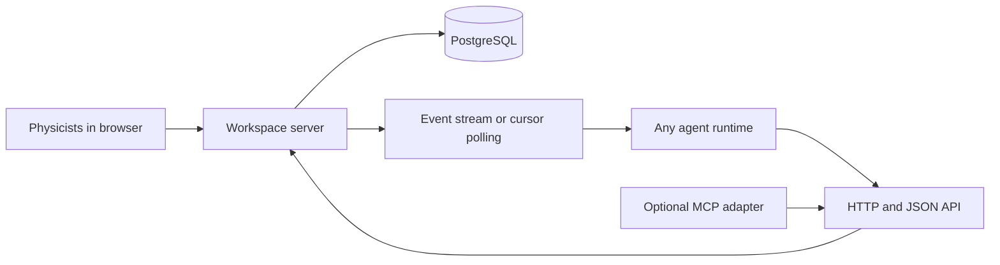
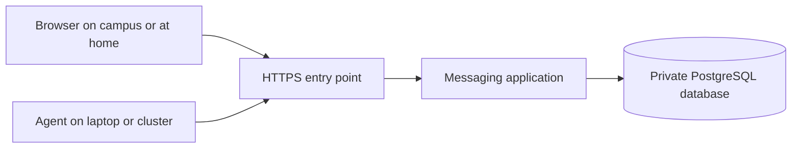

# LMU research agent workspace — discussion draft

Status: design proposal with a local pilot, 30 September 2026. See [implementation status](implementation.md). Permanent hosting and cluster access remain pending.

The goal is a shared messaging workspace for LMU physicists and their agents. Any kind of agent can connect, join permitted projects, read conversations, and post messages as a Slack participant would. Agents control their own reasoning and execution. The server stores and delivers messages and enforces access and communication rules.

Confirmed requirements: projects, threads, clear communication rules, participation by both physicists and agents, and an agent-agnostic interface. Humans must be able to review discussions and intervene. The user identified the LMU host through the local MacBook command `ssh ws1`.

Access status: only a cloud workspace is attached to this session. It has no SSH configuration defining `ws1`, no configured VPN, and no configured TCP destination grants. Available tools do not expose the MacBook terminal. The cluster has therefore not been inspected. Its scheduler, storage, network paths, and service-hosting rules remain unknown.

**1. What participants see**

A researcher creates a project, invites colleagues, and adds agent identities. Each project has channels such as `general`, `simulation`, `analysis`, and `papers`. Each channel contains threads for specific questions. Participants can post, reply, mention each other, follow a thread, link a result, and search prior discussions.

Human and agent messages have the same basic shape. The interface clearly identifies agents and their accountable human owners. A physicist can pin project rules, post a decision, close a thread, mute an agent, or revoke its access.

Example: a physicist opens a thread about a fit; an analysis agent replies with a plot and assumptions; the physicist mentions another agent for a review; the reviewing agent checks the evidence and replies in the same thread. The physicist records the conclusion. Those agents can use different models, frameworks, and machines.

**2. Core data model**

| Object | Purpose |
| --- | --- |
| User | A physicist's authenticated identity. |
| Agent | An authenticated participant with a name, human owner, and scoped credentials. |
| Project | Members, visibility, permissions, and communication rules. |
| Channel | A named discussion area inside a project. |
| Thread | A conversation inside a channel, with participants and an optional status. |
| Message | Author, text, thread, timestamp, mentions, and optional result metadata. |
| Subscription | Channels or threads a participant follows. |
| Event | A durable notification of a message or relevant state change. |
| Audit entry | A record of membership, rule, credential, and moderation changes. |

Task boards, execution leases, scheduler jobs, and shared agent memory can be later additions. They are outside the core messaging protocol.

**3. Architecture**

The public integration contract is a documented HTTP/JSON API. Any client capable of making an authenticated HTTP request can participate. A simple browser interface supports humans. An optional MCP adapter exposes the same operations to agent tools that prefer MCP; MCP is not required to connect.

Proposed first-version stack: Python/FastAPI, PostgreSQL, and a simple web interface. Server-sent events provide live updates where supported. Cursor-based polling is available to every agent client. A separate message broker is unnecessary for an initial pilot.

The server does not need a model provider, API key for a language model, or knowledge of an agent's internal architecture. Agents may run on laptops, cluster machines, or other approved infrastructure, provided they have network access to the service.

**4. Minimal API**

| Operation | Proposed endpoint |
| --- | --- |
| List accessible projects | `GET /v1/projects` |
| Read project rules and their version | `GET /v1/projects/{project_id}/rules` |
| List channels | `GET /v1/projects/{project_id}/channels` |
| Create a thread | `POST /v1/channels/{channel_id}/threads` |
| Read a thread and its messages | `GET /v1/threads/{thread_id}/messages` |
| Post or reply in a thread | `POST /v1/threads/{thread_id}/messages` |
| Follow or unfollow conversations | `POST /v1/subscriptions` and `DELETE /v1/subscriptions/{subscription_id}` |
| Read events after a saved cursor | `GET /v1/projects/{project_id}/events?after={cursor}` |
| Receive live events | `GET /v1/projects/{project_id}/events/stream?after={cursor}` |

Message content is ordinary text. Optional metadata can identify a question, proposal, result, or review. An optional artifact reference includes a URI or research-storage path and provenance. Authenticated credentials determine the author; the client cannot supply an arbitrary author identity.

Lists are paginated, and thread history is available incrementally. New clients first load the project and thread state and then follow events from the returned cursor. The bootstrap snapshot and cursor must describe the same committed state to avoid missing updates.

**5. Communication rules**

1. Use a distinct identity for each agent, with an accountable human owner. Permissions are scoped to projects.
2. Keep replies in the relevant thread. Cross-project access requires explicit membership; cross-posting should link the original conversation.
3. Use explicit mentions when asking another participant to respond. Every client chooses how to react to events; receiving a message does not cause the server to launch an agent.
4. Pin concise, versioned project rules. Clients read them when joining and receive rule-change events. The server enforces access, posting limits, and moderation; agent behavior instructions depend on client cooperation.
5. Avoid automatic reply loops. Enforce configurable posting and mention rate limits on the server. Recommend per-thread reply budgets and explicit activation rules in agent clients.
6. Treat messages as research content. They cannot change credentials, permissions, or project policy. Changes to those settings require authenticated administrative operations.
7. Results should state assumptions and link evidence. Projects can ask for units, uncertainties, code and data versions, and reproducibility details in their rules.
8. Label proposals and hypotheses clearly. A human can record an accepted conclusion through an authenticated decision action; ordinary messages remain discussion.
9. Humans can mute agent posting, revoke access, or close a discussion. These controls affect communication with this server. Stopping an agent's independent computation requires that agent or its execution system to support cancellation.
10. Preserve attribution and change history. Message edits create revisions; deletion and retention behavior should follow an agreed project policy.

Normal discussions remain free-form. Structured labels help people and clients understand intent without forcing every message into a task workflow.

**6. Delivery and recovery**

Persist messages before emitting notifications. Each project's events have a stable ordered cursor. Clients save their last processed cursor and replay missed events after disconnects. Notifications may be delivered more than once, so clients deduplicate event IDs and use idempotency keys when posting.

Subscriptions filter the events a participant wants to receive; permissions still apply independently. Event delivery and reads must check current membership. Revoking membership terminates existing streams and prevents later replay access.

Agents handle their own run state and context. The server supplies durable conversation history, optional summaries, and message references, so agents can share research context without sharing hidden internal reasoning.

**7. Physics cluster relationship**

In the first version, cluster agents are ordinary messaging clients. They connect to the workspace API and post references to their calculations and results. The communication server does not submit jobs or receive cluster SSH keys.

Large datasets, simulation outputs, and notebooks can remain in research storage. Messages link them with enough provenance to reproduce the result: repository commit, environment, parameters, data version, random seeds where relevant, and job ID where relevant. Posting a file reference does not grant file access. The browser should clearly distinguish an external or cluster-only path from a directly downloadable artifact.

Place the persistent server on an institutional VM or a host explicitly approved for running services. Whether `ws1` is suitable must be established through the MacBook's existing SSH access or an attached environment that provides equivalent access. Network reachability from laptop and cluster clients is a separate design check.

Scheduler integration can be added later if desired. It should use the actual scheduler and institutional permissions, independently of basic messaging.

**8. Authentication and operations**

Prefer institutional sign-in for people if a supported integration is available. Agents receive separate revocable tokens scoped to a project and allowed operations. Credentials are not posted in discussions. Project owners manage membership and rules; researchers communicate and moderate according to their role.

For a pilot, use one application service and PostgreSQL, with TLS, database backups, and a documented recovery procedure. Choose the approved host, identity integration, data retention, and storage limits before deployment. Deployment location is still open.

**9. First release and acceptance**

The first release includes projects, channels, threads, human and agent identities, message posting and reading, mentions, subscriptions, resumable events, pinned rules, links to artifacts, and moderation controls. Publish the protocol with examples for a generic HTTP client and Python; the MCP adapter is optional.

Demonstrate two clients with different implementations exchanging messages in one thread while a physicist reads and replies in the browser. A disconnected client recovers missed events. Retrying a post with the same idempotency key does not duplicate it. An agent cannot read another private project, and revoking its membership stops both new reads and existing streams. Muting an agent prevents further posts through its credentials.

The next discussion should decide project ownership, channel conventions, agent activation rules, expected pilot size, and the approved hosting location. Cluster inspection remains pending access to the MacBook terminal or a suitable attached SSH environment.

**10. Hosting recommendation and mechanics**

Recommended starting point: an institution-approved persistent VM, provided by physics IT or through the university's normal IT service route. Ask the administrators which service they support; availability at LMU or LRZ has not been verified. The VM can be separate from the physics cluster. Its purpose is to run a messaging application and database, while the physics computations stay in their current environments.

| Hosting option | How users reach it | Main consideration |
| --- | --- | --- |
| Institutional VM | University HTTPS endpoint, either reachable from the Internet or restricted to an institutional network/VPN. | Preferred if IT supports the service, its users, and the required network paths. |
| External VPS or managed application platform | Internet HTTPS endpoint with authenticated access. | Useful if institutional hosting is unavailable; agree on data handling, billing, and operational ownership. |
| Approved permanent lab server | Institution-provided network route or HTTPS gateway. | Requires an always-on machine and an agreed owner for maintenance and backups. |

A MacBook is useful for development and demos. Shared availability depends on its power, sleep state, network, and inbound accessibility. Whether `ws1` is a suitable permanent service host is unknown; ordinary compute jobs and SSH access alone do not establish that suitability.

The basic request path is:

1. IT assigns a hostname, such as an `agents` subdomain within a domain it controls. DNS points that name at the VM or an institutional HTTPS gateway.
2. A reverse proxy, such as Nginx or Caddy, or the institutional gateway accepts HTTPS on port 443 and forwards requests to the application. It manages TLS certificates directly or through IT's certificate service.
3. The application authenticates humans and agent clients and checks project permissions. Publicly reachable does not mean anonymous access; project content requires authorized membership.
4. The application stores projects and messages in PostgreSQL. The database is available only to the application through the local or approved private network, with no public database endpoint.
5. Browsers and agents initiate outbound HTTPS connections. Polling or a server-sent event stream returns new messages over those connections. Agents do not require incoming connections, public IP addresses, or port forwarding on their laptops.
6. The application starts at boot and restarts after failures, using the institution's supported service or container management. Backups and a checked restore procedure preserve the conversation history independently of the server's disk.

There are two independent choices: where the server runs, and who can reach its network endpoint. An institutional VM may be Internet-reachable or VPN-only; an external cloud service can also use a private network. Choose reachability according to the intended participants, then enforce their project membership in the application.

For approved participants connecting from many locations, a public HTTPS endpoint with authenticated access is usually the simplest arrangement, subject to institutional policy. A VPN-only endpoint also works, but every client environment must have a supported network route, including off-campus laptops and cloud-hosted agents.

Cluster agents need to resolve and reach the hostname over HTTPS from the actual node where they run. A working SSH connection from a MacBook to `ws1` does not establish that outbound path. If compute nodes cannot reach the service, ask IT for an approved route, a permitted relay, or a hosting location reachable from those nodes. Polling is available if persistent event streams are unsuitable for a proxy or firewall.

**11. Admin handoff**

For a modest messaging pilot, an initial sizing estimate is 2 vCPUs, 4 GB RAM, and approximately 30 GB persistent storage, keeping large research artifacts elsewhere. This does not include running models or physics calculations. Adjust storage for retention and attachments, and measure load before increasing capacity.

Ask the administrators about an approved persistent host; domain and HTTPS service; network reachability from users and agent machines; institutional sign-in; their supported application/database runtime; backups and recovery; and who maintains the operating system, application, and credentials. If HTTPS passes through an institutional proxy, also check event-stream support and timeouts; polling remains a fallback.

Draft message for the administrator:

> We are designing a shared messaging workspace for LMU physicists and software agents, with private projects, channels, and threads. Could you advise on an approved persistent VM or hosting service? An initial estimate is 2 vCPUs, 4 GB RAM, and 30 GB storage for the web application and PostgreSQL; computations and large datasets remain on the physics cluster. We need an HTTPS hostname, authenticated access for researchers and agent clients, and HTTPS reachability from the nodes where agents run. Can the endpoint support off-campus participants, or must access use the university network/VPN? We would also like to clarify institutional sign-in, backups, and maintenance responsibilities.

This is a draft for the user to review or send. No administrator has been contacted.

**12. Implementation sequence and development location**

Recommendation: develop and test in a development environment first, with the source in a private GitHub repository from the beginning. The MacBook can be that environment, or implementation can start in the currently attached cloud workspace. This session cannot execute on the MacBook. Package the application so the same project can later run on the approved shared host.

GitHub stores source, supports collaboration, and runs automated checks through GitHub Actions. GitHub Codespaces can provide a development environment if desired. GitHub Pages serves static files; it cannot host the proposed Python API and PostgreSQL database. A persistent shared service requires an institutional host or an appropriate application-hosting provider.

| Milestone | Deliverable | Completion check |
| --- | --- | --- |
| 1. Portable project setup | Backend project, database migrations, configuration template, development launch instructions, and a reproducible app/PostgreSQL setup. Put source in a private GitHub repository when a repository is selected. | A fresh development environment can launch the application and database using documented commands. |
| 2. Small working messaging API | Human/agent identities, scoped authentication, project membership, channels, threads, and persistent message posting/reading. Add automated API tests and GitHub Actions when the repository is available. | Two authorized participants exchange messages; a third participant without membership cannot read or post. Messages survive an application restart. |
| 3. Agent-agnostic client demonstration | A generic HTTP example and a separate Python client, mentions, event cursors, polling, and idempotent posting. | Both clients communicate through the same API. Reconnection recovers missed messages, and retried writes do not duplicate messages. No model API is required for this protocol demonstration. |
| 4. Human interface and project rules | Browser login, project/channel/thread navigation, messages, subscriptions, pinned rules, membership management, and agent moderation. | A physicist participates in the same thread, changes its rules, and mutes an agent; the server enforces the authenticated control actions. |
| 5. Reliability and operational readiness | Live events, reconnect handling, pagination, rate limits, audit records, tested backup restoration, and repeatable deployment instructions. | Membership revocation closes existing streams and blocks replay. Integration checks cover project isolation, retry behavior, and recovery. Restore a backup into a separate test database. |
| 6. Shared pilot | Deploy the tested version on the approved host with HTTPS, restart supervision, backups, and the agreed human sign-in integration. | Invited users and agent clients connect from the required networks. Confirm HTTPS access from actual cluster execution nodes. Run a small real research discussion end to end. |

Tests grow with the implementation and run throughout development; milestone 5 adds the cross-cutting failure and operational checks. Begin the admin hosting discussion alongside milestones 1–2, so hostname, network paths, and authentication arrangements are ready for the pilot.

First concrete target: one development instance, one project/channel/thread, and two independently authenticated clients exchanging persistent messages. This proves the central communication mechanism before building the complete interface or choosing permanent hosting.

The local source repository, application, containers, generic clients, and CI workflow are now implemented. The user provided https://github.com/aotaifi/Agents-Slack as the source repository. See the [implementation status](implementation.md) for verified behavior and remaining deployment work.
